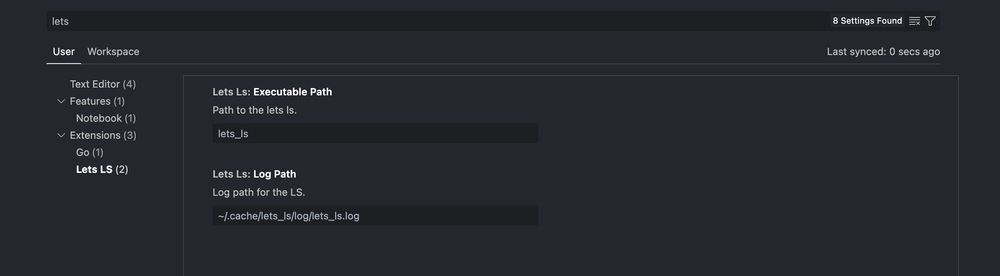

# Lets task runner Language Server (lets-ls)

## Features

- **Go To Definition**
  - Navigate to definitions of `mixins` files

## Configuration

Initialization options:

- **log_path**: location for LS log

## Installation

### Build from source

```sh
cargo build --release
```

Executable can then be found at _target/release/lets_ls

## Integration with VSCode

Extension can be found [here](https://marketplace.visualstudio.com/items?itemName=kindritskyimax.lets-ls).

For now, you need to install `lets_ls` binary yourself since extension does not support binarry installation yet. See [Installation](#installation)

After binary installed, you can edit `Lets LS` extension configuration and specify binary path.

By default its `lets_ls`. If you have any trouble with language server not starting, try to set full path to your binary.

### Settings

